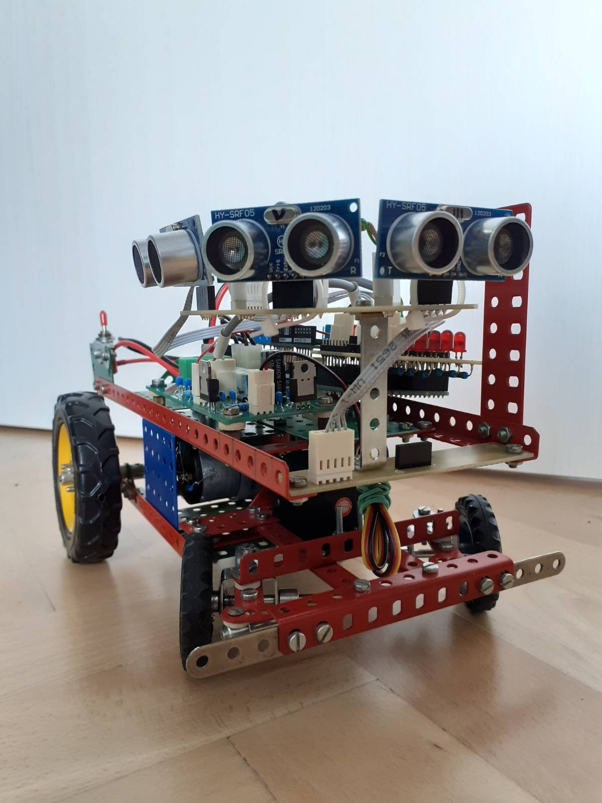

# wallckr
wallckr stands for **wall** following mobile robot with A**ckr**man steering. In other words, wallckr is a small indoor autonomous vehicle with "car like" steering that goes around your walls and avoids obstacles. 

  

## Why?
The main purpose of this project is to have fun building such a robot and developing its code. If anyone got inspired by this to build a similar project, it would be a very nice side effect. 

## Getting Started
### Hardware Prerequisities
Well, this is the tricky part, because you need to have your own wallckr robot and as far as I know there happens to be only one - the one in my possession :) 

Here is at least a list of the main HW components: 
- Arduino Mega2560 (or compatible)
- Motor Shield L298P for Arduino 
- Hitec HS-422 servo
- 3x HY-SRF05 ultrasound distance sensors
- Custom PCB to distribute power 
- Custom PCB to extend IO capabilities 

### Software Prerequisities
- PlatformIO
  - Is used as a build management tool 
  - [Install platformio](https://platformio.org/install) either as a standalone tool or as an extension for your favorite IDE
    - In case you want to use it as a standalone tool consider adding it to your $PATH: `export PATH=$PATH:$HOME/.platformio/penv/bin`
- Arduino libraries
  - NOTE: These libraries are defined in `platformio.ini` and platformio downloads them automagically during first build, there is no need to download them manually 
  - [NewPing](https://bitbucket.org/teckel12/arduino-new-ping/wiki/Home)
  - [Servo](https://github.com/arduino-libraries/Servo)
- [Optional] [simavr](https://github.com/buserror/simavr)
  - Is used to executed unit tests on simulated target
  - Install it following the steps in the link above and make sure it is in your $PATH

### Building and Uploading the Code
You can either execute the below listed commands or click the corresponding buttons in your IDE
#### Building
- `pio run`
#### Uploading
- `pio run --target upload`
#### Executing Unit Tests
On simulated target:
- `pio test --without-uploading`
- simavr has to be present, see [prerequisities](#software-prerequisities)

On real HW:
- `pio test`
#### Run static code analysis
- `pio check --skip-packages`

## Controlling your Robot
When you power your robot on, it won't move and it will be waiting for a "up arrow" command to start. This command can be sent via [ovladacka](https://github.com/ladapn/ovladacka) - the official tool to communicate with wallckr. Once this command is received, the robot starts going forward and following right-hand side wall. If no wall is present, it will keep turning right until a wall is found. When following a wall, the robot does its best to maintain a constant distance from the wall - distance of 25 cm. In this mode of operation, the angle of the front wheels is controlled automatically, while the speed is user controlled. 

You can also disable this automatic operation via ovladacka (press left shift) and control the robot manually. In this mode of operation, both the angle of front wheels and the speed are user controlled.

## Contributing
In case you would like to fix or improve anything, feel free to create a pull request. 

## License
This project is licensed under the MIT license.
